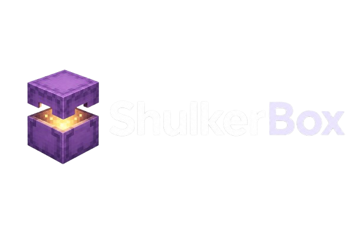
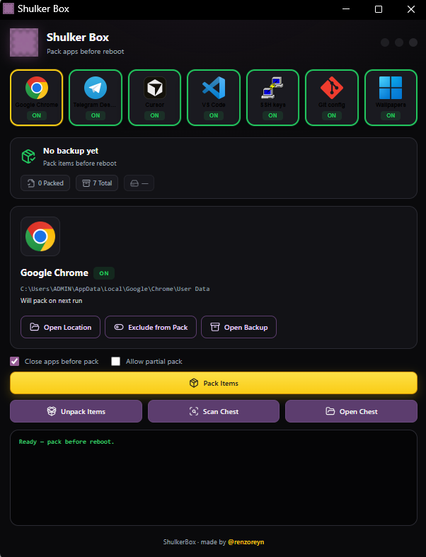

<p align="center">
  
</p>

<h1 align="center">Shulker Box</h1>

<p align="center">
  <strong>Portable backup & restore for Windows when C:\ gets wiped every reboot.</strong>
</p>

<p align="center">
  <a href="https://github.com/renzoreyn/ShulkerBox/releases"></a>
  
  
</p>

<p align="center">
  Pack Chrome, Telegram, Cursor, VS Code, SSH, Git, wallpapers, themes, and <strong>your own folders</strong> onto a drive that survives the wipe. Unpack when you're back on a fresh C:\.
</p>

<p align="center">
  
</p>

<p align="center">
  <a href="CHANGELOG.md">Changelog</a>
</p>

---

## What it does

Shulker Box copies the user data you pick from **C:\** into `backup/latest` next to the app. After the lab PC resets, hit **Unpack** and your stuff comes back.

- **Built-in apps** — Chrome, Telegram, Cursor, VS Code, SSH, Git, wallpapers (toggle ON/OFF per tile).
- **Custom folders** — any path you add (projects, saves, game mods, etc.).
- **Windows settings** — registry + display language on every pack (see the settings row in the UI).
- **Stats bar** — how many items are in the chest, total chest size, and when you last packed.

Click a tile to select it, click again to toggle ON/OFF. Green = ON, red = OFF, gold dot = already in the chest.

---

## Quick start (plug and play)

1. Open **[Releases](https://github.com/renzoreyn/ShulkerBox/releases)** and download the latest **windows-portable** zip.
2. Extract the whole folder to a drive that survives reboot, e.g. `D:\ShulkerBox`.
3. Run **ShulkerBox.exe**.

First launch needs internet once (fonts + app icons). Your backups and settings stay in that folder.

| File / folder | Purpose |
|---------------|---------|
| `backup/latest/` | Your chest (packed data) |
| `enabled.json` | Which built-in apps are ON for the next pack |
| `custom_folders.json` | Custom paths you added in the UI |

---

## Custom folders

1. Click **+ Add custom folder** under the app row.
2. Enter a **name** and **path** (e.g. `D:\Projects`).
3. **Pack Items** — data goes to `backup/latest/folders/custom-…/`.
4. A **`shulkerbox-source.txt`** file is written in that chest folder **before** the copy, with the original path so **Unpack** knows where to restore even if you move the install or edit `custom_folders.json` later.

To remove a custom entry from the list (not your real files), select it and use **Remove custom**.

---

## In-app updates

1. **Updates** in the title bar checks [GitHub Releases](https://github.com/renzoreyn/ShulkerBox/releases).
2. If you're current: **You're Running the Latest Version of ShulkerBox**.
3. If a newer release exists: download → **Restart to install** (keeps `backup/`, `enabled.json`, and `custom_folders.json`).

---

## Typical workflow

| When | Do this |
|------|---------|
| PC is set up how you like it | Turn ON what you need, add custom folders, then **Pack Items** |
| After C:\ was wiped | **Unpack** |

Tip: use **Scan** before packing if something is still running and blocking a copy.

---

## What's backed up

**Folders (pick in UI)**

- Google Chrome, Telegram, Cursor, VS Code  
- SSH keys, Git config, wallpapers  
- Any **custom folder** you add  

**Every pack (automatic)**

- Windows themes, colors, keyboard, locale, taskbar (registry)  
- Display languages (PowerShell export)  

---

## Under the hood (high level)

No source code in this public repo. Roughly:

- **Pack** — `robocopy` for folders, `reg export` for registry, PowerShell for language lists.
- **Unpack** — restores folders to the same paths; custom items use `shulkerbox-source.txt` from the chest.
- **GUI** — local web UI in an Edge app window (no Python on the target PC).

<details>
<summary>Example: custom folder marker in the chest</summary>

```
backup/latest/folders/custom-my-projects/
  shulkerbox-source.txt    ← first line: D:\Projects\MyStuff
  …mirrored files…
```

</details>

---

## FAQ

**Do I need Python?**  
No. Download the portable release and run the exe.

**Where does my backup live?**  
`backup\latest\` inside the folder you extracted.

**Can I move the install?**  
Yes, on a drive that is not wiped (usually `D:\`). Keep `backup\`, `enabled.json`, and `custom_folders.json` with it.

**Why does the chest size pill matter?**  
So you know how large the portable backup is before copying it to a USB or lab drive.

---

## For maintainers — build & GitHub release

Full source stays on your dev machine. The public repo is a landing page (README, [CHANGELOG.md](CHANGELOG.md), LICENSE, images) plus **Releases** zips only.

### One-time setup

- Windows 10/11, Python 3.10+ installed  
- Repo cloned at e.g. `D:\ShulkerBox`  
- `pip install pyinstaller` (or let `build-portable.bat` install it)  
- [GitHub CLI](https://cli.github.com/) (`gh auth login`) optional but handy  

### Step 1 — Build the portable exe

```bat
cd /d D:\ShulkerBox
build-portable.bat
```

Output: `dist\ShulkerBox-Portable\ShulkerBox.exe` (+ `_internal\`, `tools\`).

Test locally:

```bat
dist\ShulkerBox-Portable\ShulkerBox.exe
```

Or dev UI without rebuilding:

```bat
run-gui.bat
```

### Step 2 — Package release files

```bat
make-release.bat
```

This syncs the web UI into the portable tree and creates:

| File in `release\` | Upload to GitHub? |
|--------------------|-------------------|
| `ShulkerBox-1.0.3-windows-portable.zip` | **Yes** (users download this) |
| `ShulkerBox-1.0.3-update.json` | **Yes** (in-app updater SHA256 check) |
| `ShulkerBox-1.0.3-RELEASE_NOTES.md` | Paste into release description |
| `ShulkerBox-1.0.3-source.zip` / `.tar.gz` | Optional (not on public repo) |

Bump version in `make-release.bat` / `scripts\package_release.py` when you ship a new tag.

### Step 3 — Update public repo (README + changelog)

```bat
setup-github-assets.bat
```

Copies `README.md`, `LICENSE`, `CHANGELOG.md`, and images into `github-public\`. Push **only** that folder to `main`:

```bat
cd github-public
git init
git remote add origin https://github.com/renzoreyn/ShulkerBox.git
git add .
git commit -m "docs: v1.0.3 README and changelog"
git push -u origin main
```

(Use your normal workflow if the repo already exists.)

### Step 4 — Create GitHub Release

**In the browser**

1. https://github.com/renzoreyn/ShulkerBox/releases → **Draft a new release**  
2. Tag: **`v1.0.3`** (create new tag)  
3. Title: **Shulker Box v1.0.3**  
4. Description: paste `release\ShulkerBox-1.0.3-RELEASE_NOTES.md` or the [1.0.3] section from [CHANGELOG.md](CHANGELOG.md)  
5. Attach:  
   - `ShulkerBox-1.0.3-windows-portable.zip`  
   - `ShulkerBox-1.0.3-update.json`  
6. **Publish release**

**With GitHub CLI**

```bat
cd /d D:\ShulkerBox
gh release create v1.0.3 ^
  "release\ShulkerBox-1.0.3-windows-portable.zip" ^
  "release\ShulkerBox-1.0.3-update.json" ^
  --title "Shulker Box v1.0.3" ^
  --notes-file "release\ShulkerBox-1.0.3-RELEASE_NOTES.md"
```

### Step 5 — Upgrade your own install

1. Do **not** delete `backup\`, `enabled.json`, or `custom_folders.json`.  
2. Extract the new zip over your install (or copy `ShulkerBox.exe` + `_internal` + `tools`).  
3. Run the app → **Updates** should show you're on latest after this release is live.

Users on **v1.0.2** can update in-app once **v1.0.3** is published.


## License

**Proprietary / closed source.** All rights reserved. No redistribution without permission.

See [LICENSE](LICENSE).

---

<p align="center"><sub>made by <a href="https://github.com/renzoreyn">@renzoreyn</a></sub></p>
